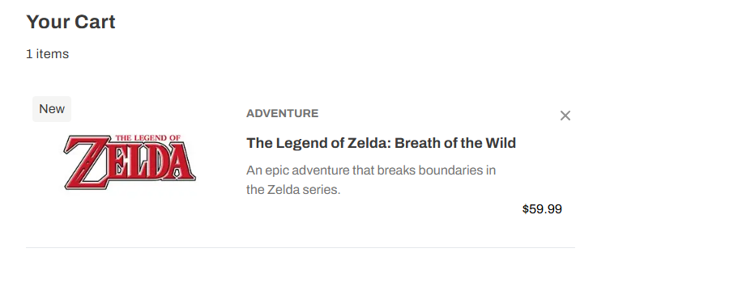
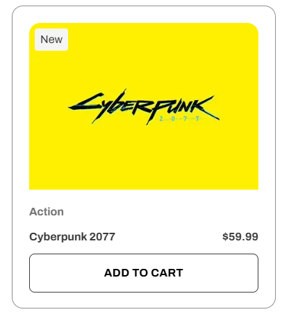
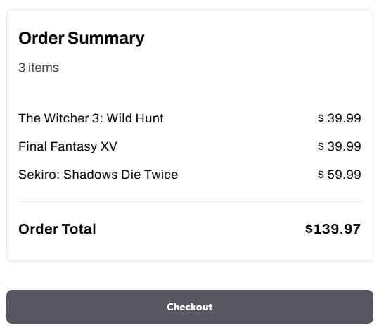

  

<h3 align="center">ad-frontend-test</h3>

---

 This project is a technical test provided by APPLY DIGITAL. <a href="https://github.com/reigncl/frontend-test-template">Original Repo </a>  

## 📝 Table of Contents

- [REQUIREMENTS](#requirements)
- [DELIVERABLES](#deliverables)
- [ACHIEVEMENTS](#achievements)
- [EXTRA](#extra)
- [DELIVERABLES](#deliverables)

## REQUIREMENTS

### General

- Games added to the cart should persist on local storage.
- Deployment of the web app on Vercel from your own GitHub repository.
- The web app must have a responsive design.
- Implement unit testing.
- Do not use any 3rd party components like Material-ui, Shadcn-ui, etc. Use the TailwindCSS config file for colors, etc.
- In the footer, the Apply Digital logo should redirect you to the route "/".
- The header should only have two navigation elements, a logo that redirects you to "/" and a cart icon to "/cart"

### Catalog Page

- The page must have a loading indicator.
- The selected "genre" filter should persist on the url and be used when querying the results if the page is visited for the first time using these parameters.
- When clicking on the "Add To Cart" button, the game has to be added to the Cart.
- If the item is added to cart, the button should say "Remove" and if clicked it should remove the item from the cart.
- ¨See more¨ button must be implemented.
- The "genre" filter selector can be implemented using the native select element. It doesn’t need to be complex.

### Cart Page

- It should display every item added to the cart, including `name`, `description`, `price`, `image`, `genre`, and display the "New" label using the `isNew` attribute.
- The "X" button on each item should remove it from the cart.
- The Order Summary section should display the items quantity, each item's price and the order total.
- It should display a "Back to Catalog" button that takes back to "/"

## ACHIEVEMENTS

### General

- ✅ Games added to the cart persist in local storage.
   
    
 
        Accomplished using <a href="./src/services/cart.ts">cart functions</a>.
         
    

     
- ✅ Deployment of the web app on Vercel from your own GitHub repository.
   
    
 
        Accomplished. You can visit it at this <a href="https://ad-frontend-test-demisrincon.vercel.app/">link</a>.
         
    

     
- ✅ The web app has a responsive design.
   
    
 
        Accomplished using TailwindCSS.
         
    

     
- ✅ Implemented unit testing.
   
    
 
        Accomplished. You can see the tests <a href="./__tests__/">here</a>.
         
    

     
- ✅ No 3rd party components like Material-UI, Shadcn-UI, etc. were used. TailwindCSS config file was used for colors, etc.
   
    
 
        Only TailwindCSS was used.
         
    

     
- ✅ The Apply Digital logo in the footer redirects to the route "/".
   
    
 
        Accomplished. You can visit it at this <a href="https://ad-frontend-test-demisrincon.vercel.app/">link</a>.
         
    

     
- ✅ The header has only two navigation elements: a logo that redirects to "/" and a cart icon to "/cart".
   
    
 
        Accomplished. You can visit it at this <a href="https://ad-frontend-test-demisrincon.vercel.app/cart">link</a>.
         
    

     

### Catalog Page

- ✅ The page has a loading indicator.
   
    
 
        Accomplished. You can visit it at this <a href="https://ad-frontend-test-demisrincon.vercel.app/">link</a>.
         
    

     
- ✅ The selected "genre" filter persists in the URL and is used when querying the results if the page is visited for the first time using these parameters.
   
    
 
        Accomplished. You can visit it at this <a href="https://ad-frontend-test-demisrincon.vercel.app/?genre=rpg">link</a> and change the selector.
         
    

     
- ✅ When clicking on the "Add To Cart" button, the game is added to the cart.
   
    
 
        Accomplished using <a href="./src/services/cart.ts">cart functions</a>.
         
    

     
- ✅ If the item is added to the cart, the button says "Remove" and if clicked, it removes the item from the cart.
   
    
 
        Accomplished using <a href="./src/services/cart.ts">cart functions</a>.
         
    

     
- ✅ The "See more" button is implemented.
   
    
 
        Accomplished. You can visit it at this <a href="https://ad-frontend-test-demisrincon.vercel.app/">link</a>. It works as infinite scrolling.
         
    

     
- ✅ The "genre" filter selector is implemented using the native select element. It doesn’t need to be complex.
   
    
 
        Accomplished using <a href="./src/components/genre-selector.tsx">Selector component</a>.
         
    

     

### Cart Page

- ✅ It displays every item added to the cart, including `name`, `description`, `price`, `image`, `genre`, and displays the "New" label using the `isNew` attribute.
   
   
  
   
   
  
   
   
    
 
        Accomplished using <a href="./src/components/ui/new-badge.tsx">New Badge component</a>.
         
    

     
- ✅ The "X" button on each item removes it from the cart.
   
    
 
        Accomplished using <a href="./src/services/cart.ts">cart functions</a>.
         
    

     
- ✅ The Order Summary section displays the item quantity, each item's price, and the order total.
   
    
 
        Accomplished. You can visit it at this <a href="https://ad-frontend-test-demisrincon.vercel.app/cart">link</a>.
         
    

     

  
   
   

- ✅ It displays a "Back to Catalog" button that takes you back to "/".
   
    
 
        Accomplished. You can visit it at this <a href="https://ad-frontend-test-demisrincon.vercel.app/cart">link</a>.
         
    

     

## EXTRA

- Added GitHub Action for automatic testing. You can see it in action [here](https://github.com/DemisRincon/ad-frontend-test/actions).
- While loading, other buttons are locked. This was achieved using the Context API from React.

## DELIVERABLES

- A GitHub repo
- A Vercel url with the deployed solution. <a href="https://ad-frontend-test-demisrincon.vercel.app/">here</a>
